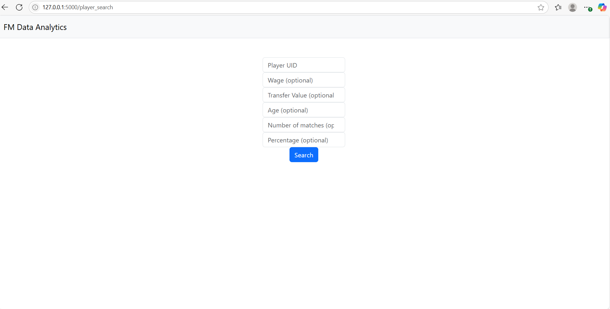

# Football Manager Data Insights Web App 

This web app allows users to upload and analyse data exported from Football Manager, providing insight into player performance, possession-adjusted stats, and potential transfer targets. It's designed for Football Manager players looking to introduce statictical analysis of players into their saves, as is done by the top professional clubs. This project was created as the final project to CS50X so all of the Flask configurations in app.py have come from that course. Currently the repo is not setup fully to run in a codespace.

## Features 
- Register, login and log out for users
- Upload CSV exports from Football Manager
- Clean and preprocess player and team data
- Adjust stats based on team possession
- Filter and find suitable transfer targets given criteria inputted from the user
- When searching for potential player replacements, the user provides several paramters:
    - UID (Unique ID): This is the unique identifier for the player in Football Manager. The app uses this to find the player the user wants to replace. 
    - Wage: 
      - If a wage value is entered, the app filters for players whose wage is less than or equal to that value.
      - If left blank, it defaults to filtering based on the wage of the selected player (via UID).
    - Transfer Value and Age: 
      - These work the same way as wage: either input a custom filter value, or leave it blank to filter using the selected player's own transfer value and age. 
    - Number of Matches: 
      - Specifies how many statistical metrics (e.g., passing, tackles, etc.) should be compared between the selected player and potential replacements.
      - The app uses predefined sets of metrics based on the player's position. 
    - Percentage Threshold:
      - Determines how strict the filtering is for each metric.
      - For example, a value of 100% filters for players whose metric values are at least equal to those of the selected player.
      - A lower percentage (e.g. 90%) broadens the filter to include players performing at 90% of the selected player's level for each metric.
- Display table of results

## Screenshots
- Registration page
  
- Login page
  
- Upload page
  
- Player search page
  
- Player search results page
  

  ## Existing bugs to be fixed
  - Currently there is a bug where the "Division" header from csv files is being loaded into the pandas data frame as "Division_x"
 
  ## Built with
  - Python
  - Flask
  - HTML/CSS
 
  ## Future Improvements
  - Take input of html file, saving the user from moving the raw outputted data from Football Manager into a csv file
  - Add visualsiations of data
  - Implement percentiles
  - Add a profile page for each player
  - Comparison of players
  - General UI appearence improvements
  - I plan to recreate this with the improvements but using the Django framework as the final project for CS50 Web Development
