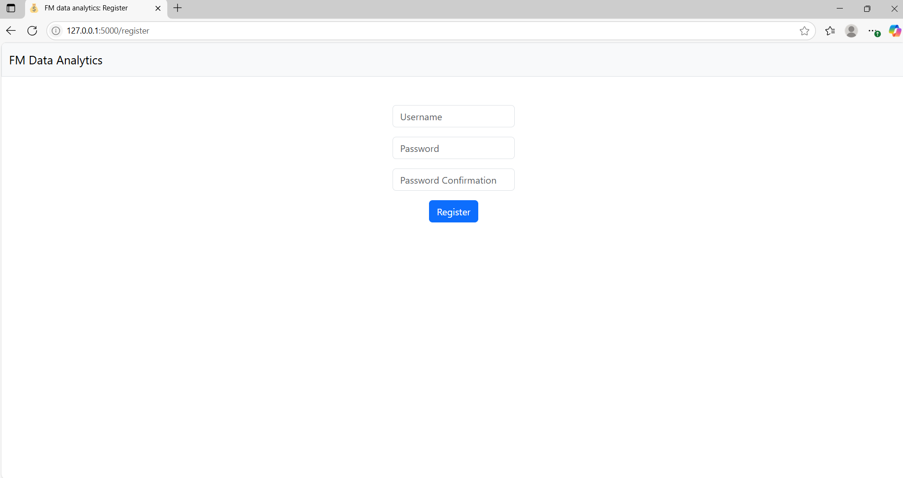
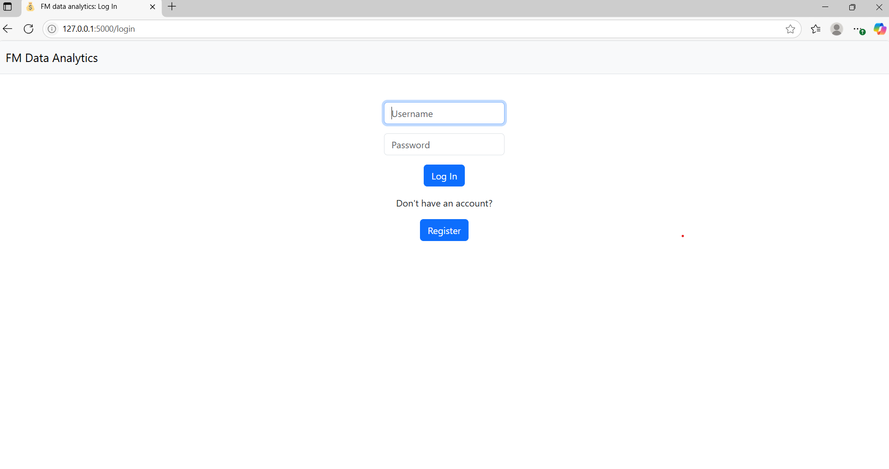
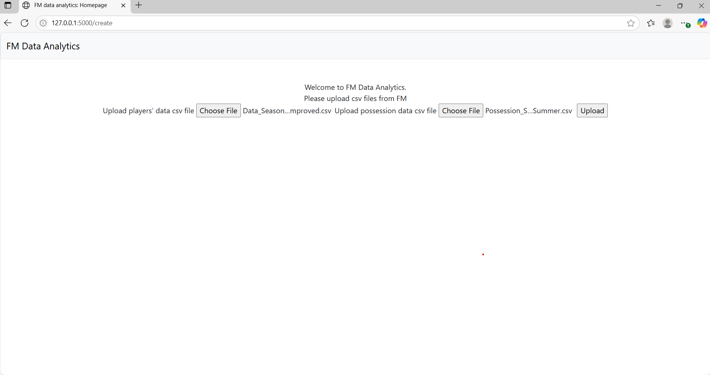
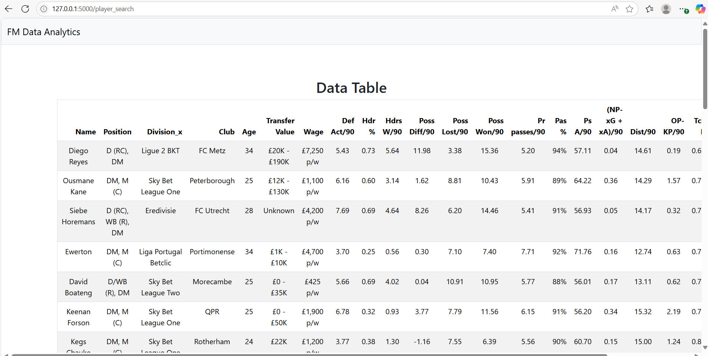

# Football Manager Data Insights Web App 

This web app allows users to upload and analyse data exported from Football Manager, providing insight into player performance, possession-adjusted stats, and potential transfer targets. It's designed for Football Manager players looking to introduce statictical analysis into their saves. This project was created as the final project to CS50X so all of the Flask configurations in app.py have come from that course.

## Features 
- Register, login and log out for users
- Upload CSV exports from Football Manager
- Clean and preprocess player and team data
- Adjust stats based on team possession
- Filter and find suitable transfer targets
- Display table of results

  ## Screenshots
  
  
  
  
  

  ## Existing bugs to be fixed
  - Currently there is a bug where the "Division" header from csv files is being loaded into the pandas data frame as "Division_x"
 
  ## Built with
  - Python
  - Flask
  - HTML/CSS
 
  ## Future Improvements
  - Add visualsiations of data
  - Implement percentiles
  - Add a profile page for each player
  - Comparison of players
  - General UI appearence improvements
  - I plan to recreate this with the improvements but using the Django framework as the final project for CS50 Web Development
